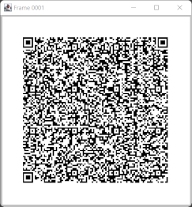
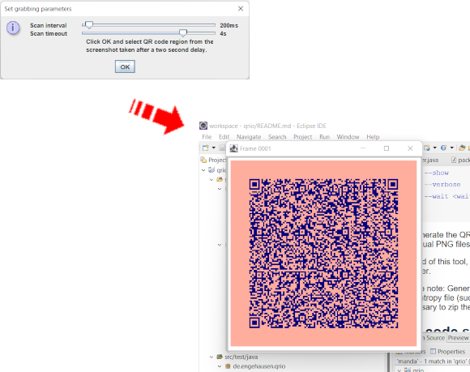

# qrio - I/O with QR code sequences

This is qrio, or should that be "cry oh!"? This is a proof-of-concept for
transferring file contents optically via QR codes.

The idea is to encode the bytes of a file as a sequence of QR codes, and
decode such sequences back to a file.

The tool has two parts: A _generator_ and a _reader_. The generator
produces QR code sequences for the bytes of a file, and the reader can
consume such sequences to produce a file again.

Apart from the frame enumeration no particular effort was spent for
robustness, so expect the decoder part to fail now and then. Success
depends a lot on reliable recognition of the QR codes.

## JavaScript version

The main tool (see below) is written in Java, but the same concept can
also be realized in JavaScript. An example can be found
[here](https://smurf667.github.io/qrio). Both generator and reader can
be used in combination with their respective Java-based counterparts.

Go there on your mobile phone, too:

## Building the tools

To build the tools run

	mvn package [-DskipTests]

The tests take some time, so you may want to skip them.

## QR code generation

The generation tool can be run with

	generate.[bat|sh]

Here is the help output:

	usage: generate
	 -b,--bytes <bytes>           bytes per QR code (a multiple of two)
	                              (default: 384)
	 -d,--dimension <dimension>   QR dimension (default: 128)
	 -e,--enumerate               stores a frame counter with the data; can be
	                              used to fail fast on decoding
	 -i,--input <input>           input file to encode (mandatory)
	 -p,--prefix <prefix>         prefix of QR code images
	 -q,--quirks-mode             zxing sometimes cannot decode QR codes it
	                              produced itself. This tries to compensate
	                              (recommended).
	 -s,--show                    show QR codes
	 -v,--verbose                 turn on debug information
	 -w,--wait <wait>             wait in ms between frames in playback mode
	                              (default: 500)

To generate the QR code sequence and display it, use the `-s` option.
The QR codes can be written to individual PNG files with the `-p` option.

Instead of this tool, a [JavaScript-based version](https://smurf667.github.io/qrio) can be
used. The tool will play the QR code sequence in a browser.

Please note: Generation and decoding of QR code sequences rely on _changing contents_
per frame. If you have a low-entropy file (such as only the same byte repeated many times), this
will not work. To ensure good entropy it may be necessary to zip the file before
encoding it as a QR code sequence.

## QR code sequence decoding

The reader tool can be run with

	read.[bat|sh]

Here is the help output:

	usage: read
	 -f,--file <file>       read .mp4 QR code video
	 -g,--grab              use screenshots to grab QR codes
	 -o,--output <output>   decoded file to write (mandatory)
	 -p,--prefix <prefix>   prefix of QR code images to read from file system
	 -v,--verbose           turn on debug information

The reader tool can grab QR codes displayed on the screen using the `-g` option.
For this, the user needs to specify how often to take screenshots, when to time out
(once the QR codes do not change any more) and where to take the screenshots.

Setting the timeout to zero means stopping the grabber manually (a "beep" will
sound each time bytes were read, and a button exists to stop the grabber).

The tool can also decode the frames of a `.mp4` video file using the `-f` option.
The video should have good image quality and a reasonable frame rate. There is an
example [test file](src/test/resources/video.mp4) used for unit tests. This video
was taken with a mobile phone and slightly converted (frame rate, orientation).
It contains the [example PDF](src/test/resources/demo.pdf) used in unit tests.

The tool can also be feed individual QR code frames using the `-p` option.
These might be frames created with the generator tool, for example.

Instead of this tool, a [JavaScript-based version](https://smurf667.github.io/qrio/client.html) can be
used. The tool will read the QR code sequence in a browser using the webcam.

Please note: The decoding process (both finding the proper frames as well as
reliably decoding the QR codes) is an error prone process. Some fiddling and
luck may be required. It will help to reduce the number of bytes in a QR code.

## Appendix

Of course, as with most anything that you can think up, "it has been done before".
I didn't look beforehand and created this tool as a kind of intellectual
exercise. I came across [this article](https://ieeexplore.ieee.org/stamp/stamp.jsp?arnumber=7370891)
mainly because it reported the same problem I had with zxing: The library seems
to have trouble with decoding QR codes it _itself generated_. I tried to compensate
with the "quirks" mode during sequence generation.

There is also a [unit test](src/test/java/de/engehausen/qrio/UnreadableTest.java)
that demonstrates the issue. The test will start to fail if the zxing library is
updated to a version that does not have this problem.

This project uses these notable open source libraries:

- [commons-cli](https://commons.apache.org/proper/commons-cli/)
- [jcodec](https://github.com/jcodec/jcodec)
- [QrCode.js](https://davidshimjs.github.io/qrcodejs/) (JavaScript)
- [qr-scanner](https://github.com/nimiq/qr-scanner) (JavaScript)
- [zxing](https://github.com/zxing/zxing)
